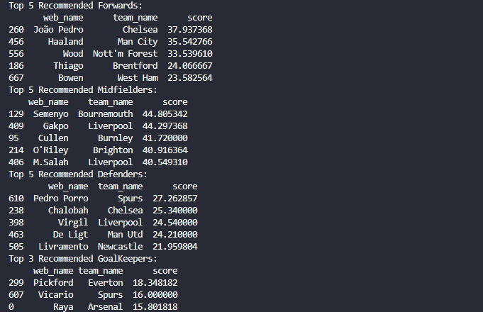

# FPL Smart Transfer Assistant ⚽️📊

## 🚀 Overview

This project is a data-driven tool to help Fantasy Premier League managers make smarter transfer decisions. Instead of relying on gut instinct, this script fetches the latest FPL data and uses a custom scoring model to rank players based on their form, value for money, and upcoming fixture difficulty.

## 📋 Key Features

- Fetches real-time player and fixture data from the official FPL API.
- Engineers predictive features like 'Points per Million' and 'Fixture Easiness'.
- Ranks players by position using a weighted recommendation score.
- Provides a simple, clean list of the top transfer targets for the upcoming gameweek.

## 🛠️ Technology Stack

- **Python**
- **Pandas**: For data manipulation and analysis.
- **Requests**: For interacting with the FPL API.

## 📈 Results

Here is a sample of the top recommended midfielders for Gameweek 3 based on the model:

*(**Instruction**: 



## 🔧 How to Run

1.  **Clone the repository:**
    ```bash
    git clone [https://github.com/your-username/your-repo-name.git](https://github.com/your-username/your-repo-name.git)
    ```
2.  **Navigate to the project directory:**
    ```bash
    cd your-repo-name
    ```
3.  **Install the required libraries:**
    ```bash
    pip install -r requirements.txt
    ```
4.  **Run the script:**
    ```bash
    python api_fetch.py
    ```